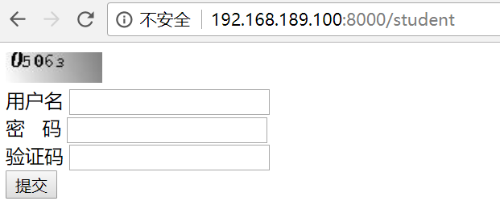
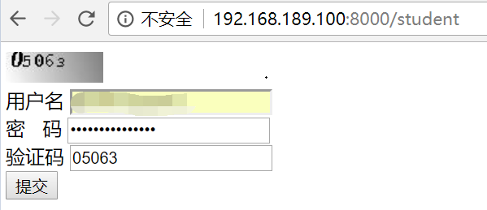
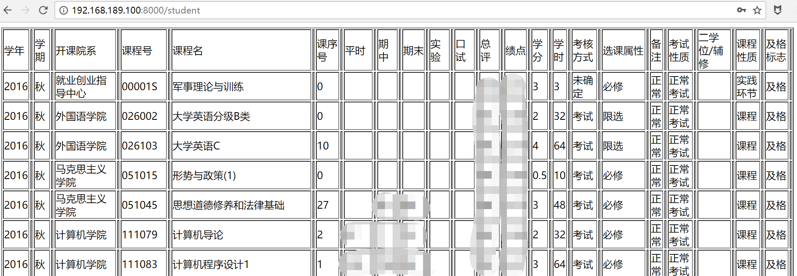

# 任务描述

> # 后台开发进阶学习任务（3月18日-3月24日）
> ## 任务1.使用PHP脚本实现网页爬虫
> * 目标：实现学校本科生课程管理系统模拟登录，验证码识别（可选，可参考开源项目），**成绩抓取** 及数据库操作
> * 涉及到的技术点关键词：`正则表达式` `Curl` `DOMXPath`
> ## **相关要求**
> 1. 关键代码具有必要的注释，基于laravel框架开发
> 2. 相关开发工作完成后将代码部署到服务器的docker容器中（自建，使用独立端口）

# 完成情况
- 已实现通过php抓取学生成绩。借助Laravel框架，服务器通过转发用户输入的用户名、密码以及验证码，即可获取到其教务系统中的成绩，并返回到页面上。
- 未实现将开发完成后的内容部署到docker容器中。我尝通过`docker search laravel`找到排名最高的`eboraas/laravel`镜像，并按照`https://hub.docker.com/r/eboraas/laravel/`所说的，使用以下命令来启动容器，但是这样只能访问欢迎页面，不能访问自定义的路由。我又将`routes`文件夹按照同样的方法挂载，结果还是会报错。至此我没有再往下尝试。
```
docker run -p 80:80
-v ${source}/app/:/var/www/laravel/app/
-v ${source}/public/:/var/www/laravel/public/
-d eboraas/laravel
```

# 运行过程展示
- 用户访问`http://{host}/student`：
- 
- 输入用户名密码验证码后点击提交
- 
- 可以看到自己在教务系统上的各科成绩
- 
